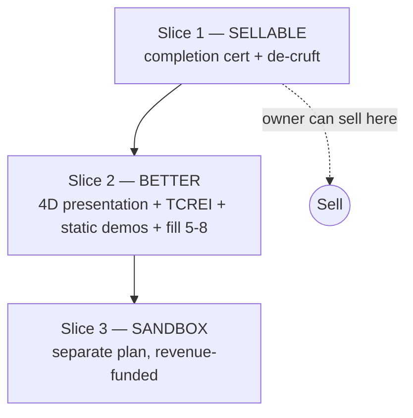

# Foundation Course — Unified Rebuild

> **Type:** enhancement · **Scope:** `/courses/foundation/program/**`, `content/courses/foundation-program/**`, `src/lib/lms/**`
> **One line:** Reorganize and enhance the existing Foundation course into one coherent, tool-agnostic experience and make the certificate completion-based — **shipped in slices, sellable after Slice 1.** The live AI sandbox is split into its own deferred plan: [`foundation-sandbox-hardening.md`](./foundation-sandbox-hardening.md).

## Enhancement summary (deepened 2026-05-21)

Pressure-tested by five reviewers (migration-safety, security, architecture, simplicity, performance). What changed from the first draft:

1. **Split into 3 slices; sandbox moved to its own plan.** The sandbox is post-MVP (the owner can sell after Slice 1). Bundling it risked letting post-MVP work gate the sale. → [`foundation-sandbox-hardening.md`](./foundation-sandbox-hardening.md).
2. **"Watch it done" = static before/after examples, not recorded-replay infra.** Kills a content-model field, versioning, cache-as-replay, and an availability AC. Same "show don't tell" value, a fraction of the work.
3. **Phase 2 cert reality corrected.** The issuance endpoint (`generate-certificate` POST) has **no caller today** — this is net-new wiring, not "flip a gate." Backfill historical completers via direct SQL (no Resend replay), normalize the banned `AiBI-P` designation, and **don't mutate `work_submissions`** (ignore the gate, keep history).
4. **D3 reframed — stable `id` already exists.** `Module.id`, an id-keyed `CourseConfig`, and a number→id bridge (`src/lib/lms/adapters.ts`) are built; only the Supabase columns are number-keyed. "Stable id" isn't deferred invention — it's a finished read model.
5. **New decision D8 — 4D phases vs. the existing 4 pillars.** The codebase already has an `awareness/understanding/creation/application` pillar taxonomy. We must decide the 4D phases *replace* it (recommended: relabel display strings, keep storage key) — otherwise Phase 1 and Phase 3 contradict each other.
6. **Forward-only unlock reconciliation.** Progress is strictly sequential (`canAccessModule`). The 4D grouping is a *map*, not a *path* — lock state is computed from `completed_modules`, never from phase position; never present a locked module as the next step.

---

## Overview

The Foundation course already has real content (12 modules with substantive prose), a 30-prompt library, defined skills/agents, synthetic sample data, and downloadable artifacts. The gap is *coherence and experience*, plus an owner-blocking problem: **the certificate is reviewer-graded** and the owner is not a teacher. This is a **re-sequence (by presentation) + enhance + de-cruft**, not a rewrite.

We adopt the structure every major vendor converged on (Anthropic 4D, Google TCREI, OpenAI role-first, Perplexity verify-the-source), use the 4D's as an internal scaffold and TCREI as the prompting framework, and keep our **prompt → skill → agent ladder** as the differentiator.

## Goal

A banker who has never opened ChatGPT can use AI on real parts of their job — safely — and walk away with a personal kit of prompts. **Completion-based, ungraded, for the individual.**

---

## Key decisions

| # | Decision | Call | Why |
|---|----------|------|-----|
| D1 | Anthropic 4D | **Incorporate** as internal scaffold + light credit; don't brand around it | It's Anthropic's IP; our identity is the ladder + banking. *Verify 4D license before branded public use.* |
| D2 | Content | **Keep + enhance**, don't rewrite | The prose exists; the gap is delivery. |
| D3 | Module identity vs. order | **Present 4D as grouping; do NOT renumber.** Stable `id` already exists (`types.ts:77`, `course-config.ts`, `adapters.ts`); only Supabase columns are number-keyed | Renumbering silently corrupts mid-course learners' number-keyed progress. Migrating the *write path* to ids is a small, separate follow-on — not part of this plan. |
| D4 | Certificate | **Completion-based**; existing graded certs stay valid; **don't mutate `work_submissions`** | Owner intent; aligns with launch spec v2 (rubric not mandated). |
| D5 | Sandbox | **Separate deferred plan**; not a launch dependency | Post-MVP. Sellable without it. → [`foundation-sandbox-hardening.md`](./foundation-sandbox-hardening.md) |
| D6 | "Watch it done" | **Static before/after example** in module content (prompt block + resulting output). Optional typewriter CSS flourish later | No replay infra, no versioning, can't have an outage. Satisfies show-don't-tell. |
| D7 | Freemium / preview gating | **Out of scope — separate plan** | Independent access feature. |
| **D8** | **4D phases vs. existing 4 pillars** (`awareness/understanding/creation/application`) | **4D replaces the pillars.** Keep the `pillar` storage field name; relabel its four display values to the 4D phases (cheap, no type churn) | Two competing 4-letter frameworks would confuse learners. Decide in Phase 0 so Phases 1 & 3 don't contradict. |
| D9 | "Complete" definition | **Read + mark-complete per module** (artifact-save encouraged, not required) | Simplest gate; pull this decision to Phase 0 — it drives the cert trigger. |

---

## The three slices

### Slice 1 — Sellable (smallest shippable; ship alone)

Removes the owner-as-grader burden and the dead code. After this, the course is completion-based, ungraded, coherent, and **sellable today.**

**Phase 0 — Decisions & safety (no code)**
- [ ] Confirm D1–D9 with owner (esp. D8 4D-replaces-pillars, D9 "complete" definition).
- [ ] Confirm completion-based cert + exam removal against `DECISIONS.md`.
- [ ] **Snapshot the tables actually mutated:** `work_submissions` + `certificates` (full, pre-change), and record which `certificate_id`s are migration-issued vs. pre-existing (for reversible rollback). *(Note: `course_enrollments`/`activity_responses` are NOT mutated — presentation-only.)*

**Phase 1 — Completion-based certificate** *(reality-corrected)*
- [ ] **This is net-new wiring, not a gate flip.** The `generate-certificate` **POST has no caller today** (`route.ts:150`); certs are issued manually. Wire the issuance call from `save-progress/route.ts` on the final-module write (it holds the transaction context), gated on `allModulesComplete(completed_modules)` (reuse `submit-work-product/route.ts:53`).
- [ ] Replace the `work_submissions.review_status='approved'` 409 gate (`generate-certificate/route.ts:170-184`) with the completion check. **Don't mutate `work_submissions`** — just stop reading it as a gate (keeps history; shrinks rollback surface).
- [ ] **Backfill existing already-complete learners via direct SQL insert** into `certificates` — bypass the POST route so no Resend email (`route.ts:263`) or `certificate-issued` analytics replays to people who finished months ago.
- [ ] **Normalize designation:** `UPDATE certificates SET designation='AiBI-Foundation' WHERE designation='AiBI-P'` (the schema default `AiBI-P` is a banned brand string per CLAUDE.md).
- [ ] Idempotency: issuance must return the existing cert (200) on retry, never duplicate-insert or re-email (existing guard at `route.ts:186-253` covers the race branch — confirm the new trigger path uses it).
- [ ] Resolve in-flight submissions: a learner with `review_status IN ('pending','failed')` who completed 12 modules gets a cert on the completion path (state: the negative status is `failed`, not "rejected"). No one stranded.
- [ ] Rewrite `CompletionCTA.tsx` (the `===9`/`isLastModule` branch, line 40) and the "pending review" copy in `certificate/page.tsx:311-316` → "download your certificate."

**Phase 2 — Remove orphan exam** *(low risk)*
- [ ] **Trace ALL references first** (grep `/exam`, `save-proficiency`, `proficiency`): remove `content/exams/foundation-program/`, route `src/app/certifications/exam/foundation/**`, `src/app/api/save-proficiency/route.ts`. Fix stale link `redesign-checklist/data.ts:129`. 308-redirect old exam URLs → course (don't 404 bookmarks). Keep written proficiency data for history; stop writing.

### Slice 2 — Better (ship next; presentation-only, no DB migration)

**Phase 3 — 4D presentation + TCREI + de-dupe**
- [ ] **Decide D8 first.** Relabel the four `pillar` display values to the 4D phases in `course-config.ts` `FOUNDATION_SECTIONS` + `PILLAR_META`/`PILLAR_DESCRIPTIONS` (`types.ts:7`); fold the legacy Terra/Sage/Cobalt → Ledger token migration **into this step** (don't do it separately in Slice 1 — it'd be thrown away).
- [ ] **Reconcile presentation with the forward-only unlock graph:** the 4D sidebar groups modules but computes each card's lock state from `completed_modules` (`canAccessModule`), never from phase position. Never render a locked module as "next." (AC-M2.)
- [ ] Surface the "Meet AI / tool map" content (from M2/M4) as the on-ramp via presentation — not a new numbered module.
- [ ] Rewrite Module 3 teaching around **TCREI** in `v4-expanded-modules.ts`; keep the artifact.
- [ ] De-dupe the M7 ↔ M2/M4 tool-landscape overlap (M7 → "tool selection / choice map").
- [ ] **Before touching M7 content, audit hardcoded persistence keys:** `IterationTracker.tsx:73` (`activityId=7.1`), `ActivitySection.tsx:225` (`===5`), `CompletionCTA.tsx:40,107`. Replace the brittle module-number branches with the *specific* condition (is-last-module, has-activity-X) — fix the actual branches, don't build a flag *system* (YAGNI).

**Phase 4 — Delivery enhancement (the "teach not read" work)** *(simplified)*
- [ ] **"Watch it done" = static before/after example** (a styled prompt block + its resulting output) baked into the existing `learnContent`/section content. No new content-model field, no replay infra. Optional: a CSS typewriter flourish over the static string later.
- [ ] Fill thin modules 5–8 (worked examples, bank specificity) — enhance, not rewrite.
- [ ] *(The existing Claude-only Practice Sandbox keeps working as-is for the "do it" beat. Multi-provider + hardening is Slice 3.)*
- [ ] *(Artifact make→save→reuse loop: defer to Slice 3 — depends on the sandbox; downloading the artifact is enough to ship.)*

### Slice 3 — Sandbox → separate plan

The live multi-provider sandbox, lifetime spend cap, server-side prompt allowlist, enrollment gate, and provider consolidation. **Revenue-funded enhancement, not a launch dependency.** Full spec, including the security P0s and the `learner_spend` ledger: **[`foundation-sandbox-hardening.md`](./foundation-sandbox-hardening.md)**.

> ⚠️ **Known live gap (decide if it blocks selling):** the existing `/api/sandbox/chat` accepts a **client-supplied system prompt + raw messages**, gated only on auth + 50/hr — a free-LLM proxy on the owner's API key. If the sandbox is reachable by non-payers, pull the **enrollment gate + "server owns the prompt"** fixes (P0s in the sandbox plan) forward into Slice 1.

---

## Acceptance criteria

**Slice 1 — certificate & cleanup**
- [ ] AC-C1: Completing all modules issues a certificate with zero reviewer involvement; the completion path returns 200 (or idempotent 200 with existing cert), never 409.
- [ ] AC-C2: No duplicate certs/emails on retry; the backfill issues historical certs with **no** email/analytics replay.
- [ ] AC-C3: No certificate carries the banned `AiBI-P` designation; existing graded certs remain valid.
- [ ] AC-C4: Every `pending`/`failed` submission for a completed learner reaches a cert (none stranded on "pending review").
- [ ] AC-E1: No live link routes to the removed exam; old URLs 308-redirect; `save-proficiency` unreachable.
- [ ] AC-R1: Phase-0 snapshot of `work_submissions` + `certificates` exists; a documented rollback deletes exactly the migration-issued certs.

**Slice 2 — presentation & content**
- [ ] AC-M1: No learner is silently credited for content they didn't see (met by D3 — no renumber).
- [ ] AC-M2: The 4D grouping never presents a locked module as the next step; lock state is computed from `completed_modules`, not phase position.
- [ ] AC-M3: All hardcoded activity ids / module-number branches audited before M7 edits; no saved `activity_responses` orphaned.
- [ ] AC-D1: "Watch it done" is static content (no provider call, can't fail).

## Risks & mitigation

| Risk | Mitigation |
|------|------------|
| Silent progress corruption | Don't renumber (D3); presentation-only |
| Cert email/analytics replay to old learners | Backfill via direct SQL, not the POST route |
| Banned `AiBI-P` brand string on certs | Normalize designation in the backfill |
| 4D vs pillar taxonomy collision | Decide D8 in Phase 0; relabel display values, keep storage key |
| 4D map vs forward-only unlock contradiction | Lock state from `completed_modules`, never phase position |
| Over-scoping into a sandbox marathon | Sandbox split to its own plan (D5); ship Slice 1 first |

## Out of scope
Freemium/preview gating (separate plan), AiBI-S/L courses, buying an external LMS, the In-Depth Assessment funnel, the multi-provider sandbox (→ its own plan).

## References

**Code:** `content/courses/foundation-program/{modules.ts,types.ts,course-config.ts,v4-expanded-modules.ts}`; `src/lib/lms/adapters.ts` (number→id bridge); `src/app/api/courses/{generate-certificate,save-progress,submit-work-product}/route.ts`; `_lib/courseProgress.ts:18` (forward-only `canAccessModule`); `_components/{CompletionCTA.tsx:40,107, IterationTracker.tsx:73, ActivitySection.tsx:225}`; `supabase/migrations/00001_course_tables.sql` (`certificates` designation default `AiBI-P` :142, `work_submissions` status CHECK :128); cleanup targets `content/exams/foundation-program/`, `src/app/certifications/exam/foundation/`, `src/app/api/save-proficiency/route.ts`.

**Canonical/spec:** `Plans/aibi-launch-spec-v2.md` (Foundation $295 lifetime, completion cert; rubric not mandated). Check `DECISIONS.md` before removing the rubric path.

**Sibling plan:** [`foundation-sandbox-hardening.md`](./foundation-sandbox-hardening.md).

**Research (this session):** four-vendor analysis (4D / TCREI / role-first / verify-source); pedagogy (gradual release, worked-example effect); current multi-provider SDK + cost/guardrail patterns (2026); five-reviewer deepening (migration, security, architecture, simplicity, performance).
